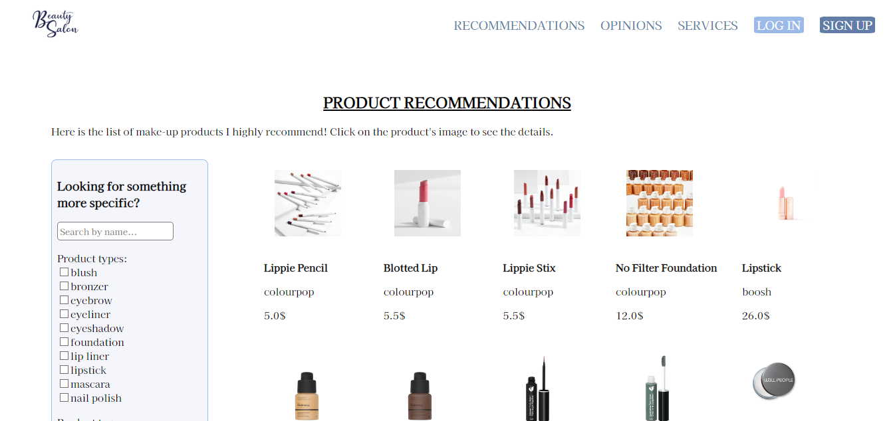
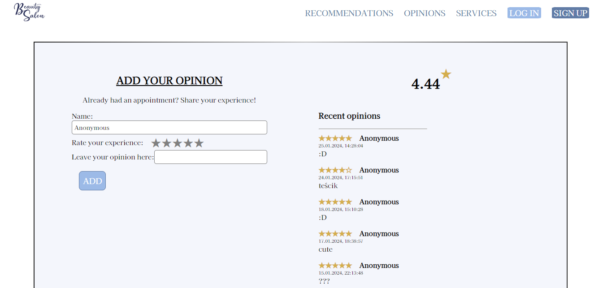
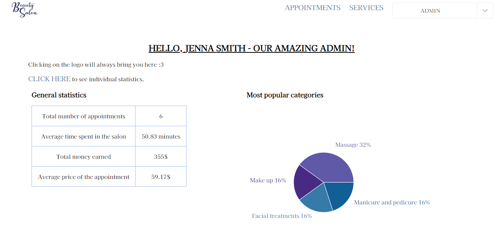
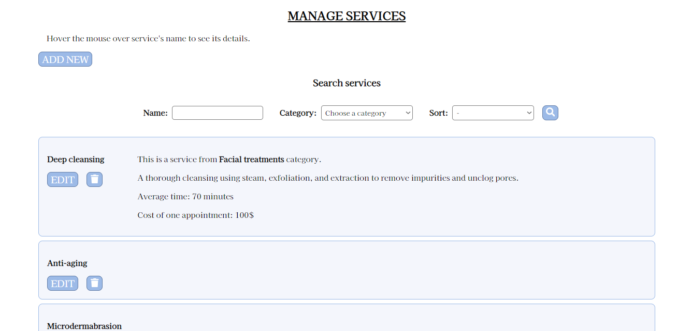

# Beauty Salon Website

The website is a full-stack university project for *Front-end Development*, *Databases II* and *Web Protocols* with Sentry implemented as a task for Meet Dynatrace Program. It was developed in December 2023 and January 2024.

### Tech stack

`Figma`  `HTML`  `CSS`  `React/Next.js`  `TypeScript`

`JavaScript`  `Node`  `Express`  `MongoDB`  `MQTT Broker` `Sentry`

### Description

The project contains front-end, back-end and connection with MongoDB database. It showcases a website for fictional beauty salon, where user can sign up and book an appointment. Adding opinions, displaying salon's rating and changing appointment's state is handled with MQTT over WebSocket. 

It also has:

- user authentication with password encryption, JWT and cookies

- roles: user and admin (owner of the salon)

- writing logs to file

- front-end components for picking date, showing statistics etc.

- observability - traces and errors handling

### Run

1. Install HiveMQ Broker (from [here](https://github.com/hivemq/hivemq-community-edition/releases))

2. Install dependencies (`npm install` in client/server respective directories)

3. In server, create `config.env` file and fill the fields below with your own MongoDB connection, server port and JWT token (for user authentication):

```env
MONGO_URI=
PORT=
JWT_TOKEN=
```

4. Replace HiveMQ configuration (`/conf/config.xml`) with `./config.xml`.

5. Add starting data to the database (examples in `/start-data`).

6. Use `npx @sentry/wizard@latest -i sourcemaps` to configure Sentry for the project.

7. Run Broker (`run.sh` on Linux and `run.bat` on Windows).

6. Run server with `node server.js` or `npm start` and client with `npm run dev` (in their directories).

### Visuals

First draft of some pages' design can be found on [Figma](https://www.figma.com/file/l1yoaZEurH4jm8BdzmViy9/beauty-salon?type=design&node-id=0%3A1&mode=design&t=GYieKUqEu7pqZKEK-1)








